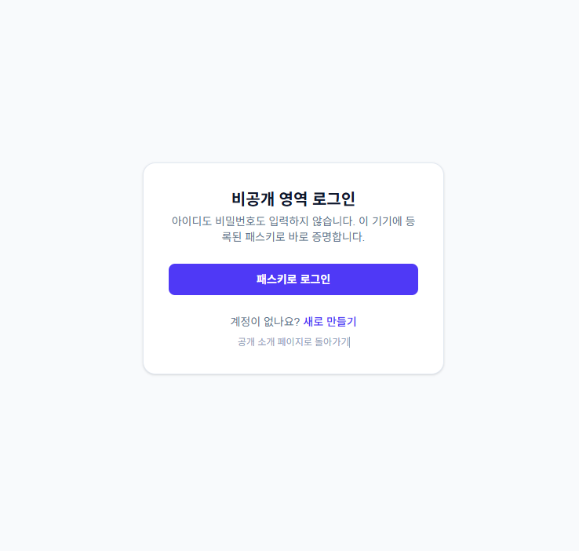
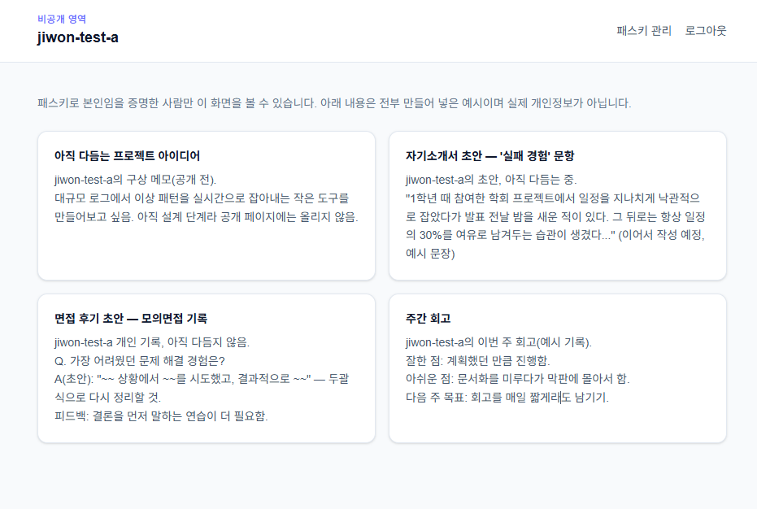
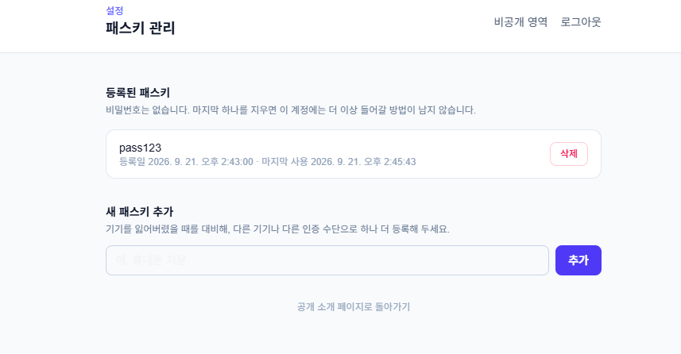
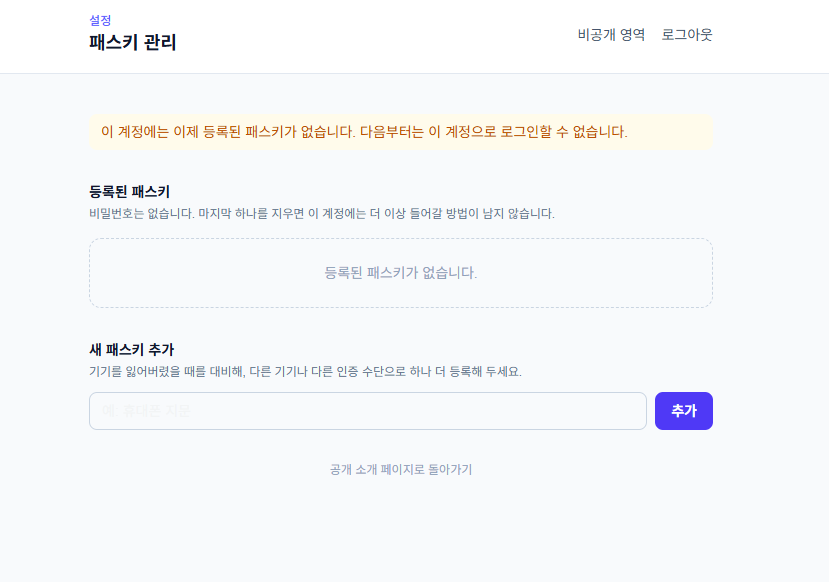

# passkey-vault (T08)

「내 소개 페이지에 패스키 달기 — 비밀번호 없이 나만 들어가기」과제 결과물.

- 배포 주소: https://passkey-vault-gamma.vercel.app
- 소스 저장소: https://github.com/gamedh823-cmd/T08
- README: https://github.com/gamedh823-cmd/T08/blob/main/README.md

- `/` : 공개 소개 페이지 (HW1 소개 페이지를 그대로 이식)
- `/register`, `/login` : 비밀번호 없이 패스키로만 계정을 만들고 로그인
- `/private` : 패스키로 로그인한 사람만 보이는 비공개 영역 (예시 데이터, 실제 개인정보 아님)
- `/settings/passkeys` : 패스키 추가 등록 / 삭제

## 화면

| 로그인 | 비공개 영역 |
|---|---|
|  |  |

| 패스키 관리 | 마지막 패스키 삭제 후 문구 |
|---|---|
|  |  |

## 아키텍처

- WebAuthn 검증: `@simplewebauthn/server` (서버) + `@simplewebauthn/browser` (클라이언트)
- 세션: `jose`로 서명한 JWT를 httpOnly 쿠키(`session`)에 저장 (`src/lib/session.ts`)
- 등록/로그인 진행 중 challenge: 별도의 짧은 만료 쿠키(`wa_ceremony`, 2분)에 저장 (`src/lib/ceremony.ts`)
- 접근 제어: `src/proxy.ts`(Next 16의 미들웨어)가 `/private`, `/settings`, 관련 API를 세션 없으면 차단
- DB: Supabase Postgres, 서버는 항상 service role key로 접근하고 RLS 대신 API 코드에서 `account_id`로 필터링 (`src/lib/db.ts`)
  - `accounts`, `passkeys`, `private_notes`, `used_challenges`(챌린지 재사용 방지) 테이블 — 스키마는 `supabase/schema.sql`
- 비공개 데이터(`private_notes`)는 전부 만들어 넣은 예시 문구이며, 계정을 새로 만들 때마다 정해진 풀에서 무작위로 골라 채워짐 → 실제 개인정보 아님

## 로컬 실행

```bash
npm install
npm run dev
```

`.env.local`에 아래 값이 필요합니다 (`.env.example` 참고):

```
SUPABASE_URL=...
SUPABASE_SERVICE_ROLE_KEY=...
SESSION_SECRET=...        # openssl rand -base64 32
RP_ID=localhost
RP_NAME=YU_JIWON Secure Access
ORIGIN=http://localhost:3000
```

## 배포

Vercel에 연결되어 있음(`passkey-vault` 프로젝트). 배포 도메인이 정해지면 Vercel 프로젝트 환경변수의 `RP_ID`(도메인만, 예: `your-app.vercel.app`)와 `ORIGIN`(`https://your-app.vercel.app`)을 배포 주소에 맞게 반드시 바꿔야 패스키가 동작합니다. (WebAuthn은 등록 시점의 도메인과 다르면 무조건 실패)

## 트러블슈팅 — Windows에서 "패스키 만들기"가 USB 보안키만 요구할 때

패스키 등록 버튼을 누르면 브라우저가 운영체제의 인증 방법 선택창을 띄우는데, **이 PC의 Windows 계정에 PIN(Windows Hello)이 하나도 등록되어 있지 않으면** "이 기기 사용" 옵션 자체가 안 뜨고, 블루투스도 꺼져 있으면 QR(휴대폰) 옵션도 안 떠서 물리 USB 보안키만 요구하는 것처럼 보인다.

해결 순서:
1. Windows 설정 → 계정 → 로그인 옵션
2. PIN(Windows Hello)이 "이 옵션은 현재 사용할 수 없습니다"로 나오면, 같은 화면의 **암호** 항목에서 Windows 계정 비밀번호를 먼저 설정 (Windows는 비밀번호가 있어야 PIN을 만들 수 있게 되어 있음)
3. 비밀번호 설정 후 PIN(Windows Hello) → 추가 → PIN 입력해서 등록
4. 다시 `/register`에서 시도하면 인증 방법 선택창에 "이 기기 사용/Windows Hello"가 나타나고, 그걸 선택하면 방금 만든 PIN으로 등록 완료됨

얼굴 인식/지문 인식이 "사용할 수 없음"으로 뜨는 건 이 기기에 해당 센서가 없어서이며 정상이다 (PIN만 있으면 패스키 등록/로그인에는 지장 없음).
